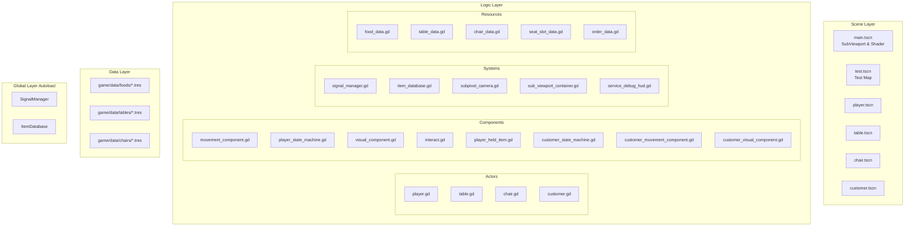
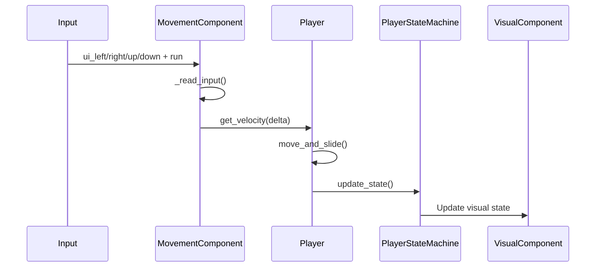
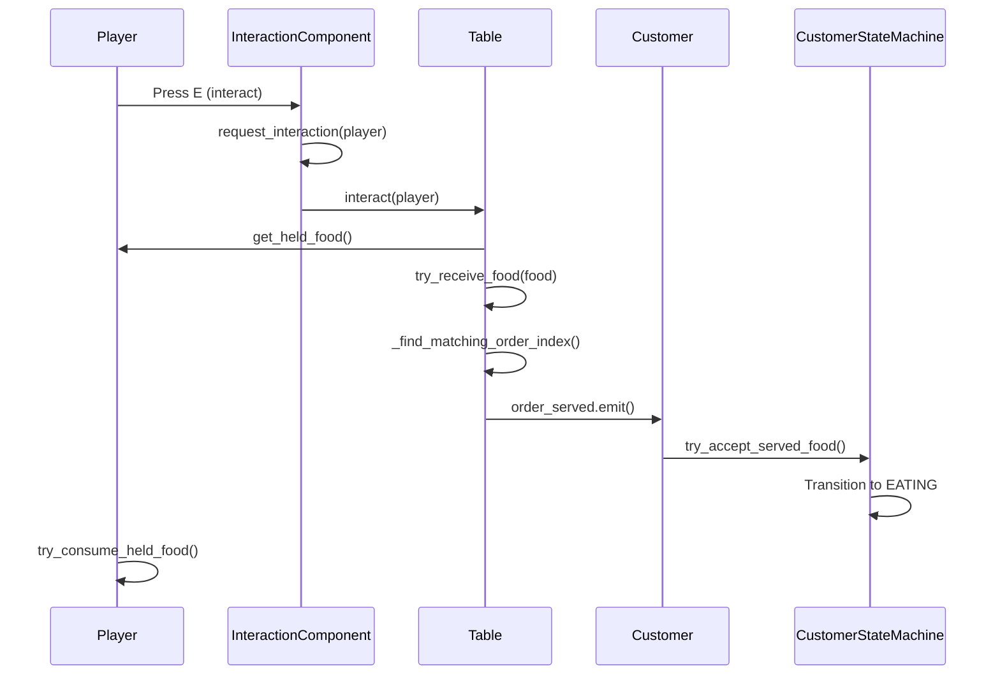
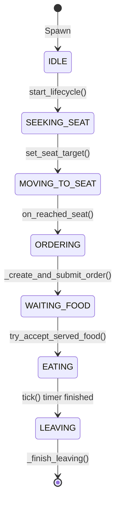
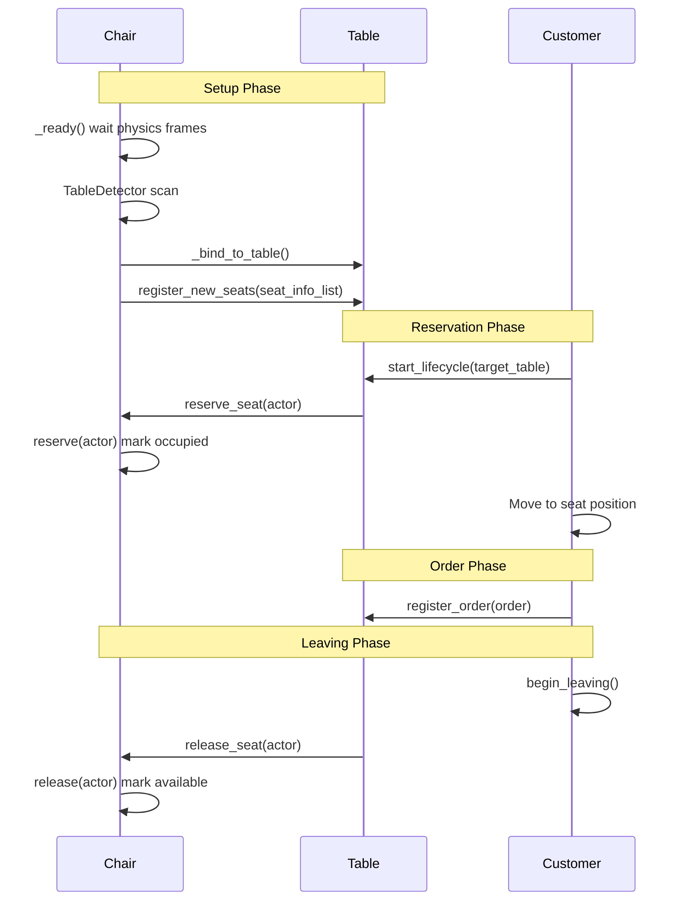
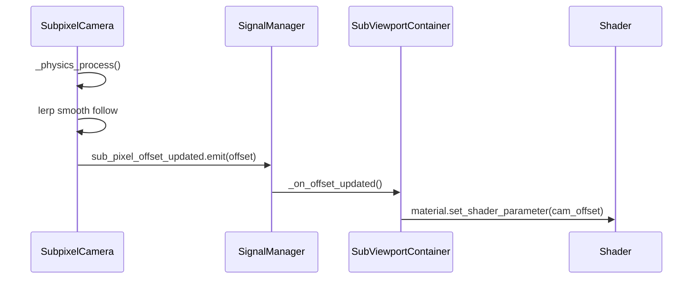
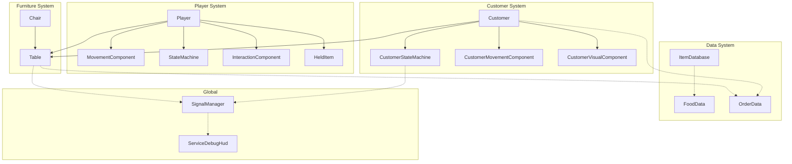
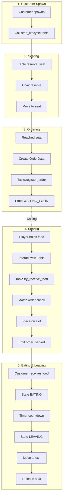

# Game System Diagrams

This file contains all Mermaid diagrams for the game architecture.

---

## 1. System Architecture Overview



---

## 2. Player Movement Sequence



---

## 3. Serving Flow (Player -> Table -> Customer)



---

## 4. Customer State Machine



### State Descriptions

| State | Description |
|-------|-------------|
| IDLE | Initial state before lifecycle starts |
| SEEKING_SEAT | Looking for available table/chair |
| MOVING_TO_SEAT | Walking to reserved seat position |
| ORDERING | At table, creating order |
| WAITING_FOOD | Order submitted, waiting for food |
| EATING | Food received, eating timer running |
| LEAVING | Finished eating, walking to exit |

---

## 5. Chair-Table-Customer Seat System



---

## 6. Table Order & Food Management

```mermaid
flowchart LR
    subgraph TableSystem[Table System]
        T[Table]
        ES["expected_orders<br/>Array[OrderData]"]
        FT[foods_on_table<br/>Array(FoodData)]
        CS[current_customers<br/>Array(Node)]
        AS[available_seats<br/>Array(Dictionary)]
        CC[connected_chairs<br/>Array(Chair)]
    end

    subgraph OrderFlow[Order Flow]
        C1[Customer]
        O[OrderData]
        F[FoodData]
    end

    C1 -->|register_order| T
    T -->|add| ES
    T -->|add| CS

    P[Player] -->|interact + held_food| T
    T -->|try_receive_food| FT
    T -->|remove from| ES
    T -->|order_served| C1
```

---

## 7. Subpixel Rendering Pipeline



---

## 8. Core Systems Interaction



---

## 9. Complete Service Loop Flow


