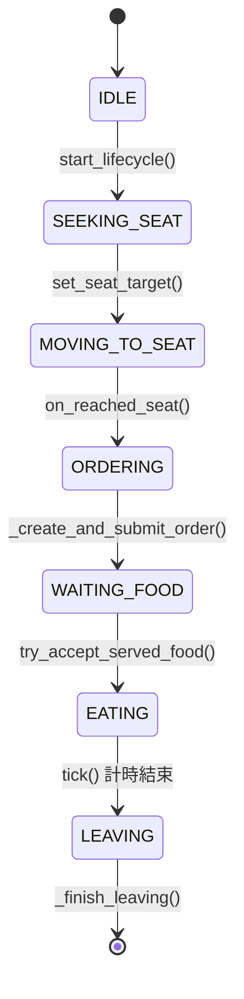
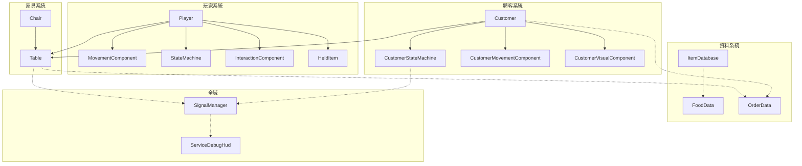

# game PM 規格與里程碑

## 文件目的
- 將目前 `game` 專案拆成可執行任務。
- 區分已完成與待完成項目，方便 sprint 追蹤。

## 當前狀態摘要
- 已完成：目錄重構、互動 action、互動基本契約、ItemDatabase 防呆、tmp 清理、型別顯式化、Customer 系統、Order 流程、送餐驗證。
- 進行中：經濟系統、UI 介面、存檔系統。

---

## Milestone 1 基礎架構整頓（已完成）

### 完成標準
- 目錄分層清楚
- 互動元件有統一入口
- 場景暫存檔清理完成

### 任務
- [x] `chair.gd` 移至 `game/scripts/actors/chair.gd`
- [x] 分層為 `actors/components/systems/resources`
- [x] 更新場景引用路徑
- [x] `InteractionComponent` 增加互動契約入口
- [x] 移除 `game/playground/*.tmp`
- [x] `.gitignore` 新增 `*.tscn*.tmp`

---

## Milestone 2 可玩核心迴圈 v1（已完成）

### 完成標準
- 玩家可觸發互動
- 至少一個目標物件有 `interact(actor)`

### 任務
- [x] 新增 InputMap action：`interact`（E）
- [x] `InteractionComponent` 可掃描並呼叫目標互動
- [x] `Table` 實作最小 `interact(actor)`
- [x] 將互動結果接到實際玩法（放置食物/狀態改變）

---

## Milestone 3 座位系統產品化（已完成）

### 完成標準
- 座位狀態模型完整
- 顧客可預約與釋放座位
- 防重複占位

### 任務
- [x] Seat 狀態模型：`available` / `occupied` / `occupied_by`
- [x] `Table.reserve_seat(actor)`
- [x] `Table.release_seat(actor)`
- [x] 防重複占位檢查
- [x] Chair 自動偵測並註冊到 Table

---

## Milestone 4 NPC 服務流程 v1（已完成）

### 完成標準
- 顧客完整生命周期
- 點餐、送餐、用餐、離開流程閉環

### 任務
- [x] NPC state machine（Enter -> FindSeat -> Sit -> Order -> WaitFood -> Eat -> Leave）
- [x] NPC 尋位與入座
- [x] 點餐創建 OrderData
- [x] 上菜驗證（訂單匹配 + 槽位檢查）
- [x] 上菜後狀態切換到 EATING
- [x] 用餐計時結束自動離開
- [x] 離席釋放座位
- [x] ServiceDebugHud 監控系統

### 狀態機詳細規格

---

## Milestone 5 經營循環 v1（進行中）

### 完成標準
- 可累積收入
- 可查看營業狀態
- 有結算畫面

### 任務
- [ ] 以 `FoodData.price` 做結算
- [ ] UI 顯示收入與服務狀態
- [ ] 計時局與結算畫面
- [ ] 顧客耐心值與小費系統

---

## Milestone 6 存檔系統（待開始）

### 完成標準
- 可儲存每日營業資料
- 可讀取並繼續遊戲

### 任務
- [ ] 設計存檔資料結構
- [ ] 實作存檔功能
- [ ] 實作讀檔功能
- [ ] 主選單介面

---

## 技術任務橫向清單

### 已完成
- [x] 關鍵腳本顯式型別化（避免 Variant 推導）
- [x] Customer 系統完整實作
- [x] Order/Serve 流程完成

### 進行中
- [ ] 相機 fallback 依賴移除（完全改為 target_path 注入）
- [ ] 定義 `IInteractable` 文件規格（目前使用 has_method("interact")）

### 待開始
- [ ] 建立最小 smoke test 清單
- [ ] 統一 Player 與 Customer 的 VisualComponent
- [ ] 重構 movement 共用邏輯

---

## Sprint 建議

### Sprint A（已完成）
- 完成 Milestone 2 未完成項
- 座位佔用 API

### Sprint B（已完成）
- NPC 入座與服務流程
- Customer 狀態機實作
- Order/Food 資料流程

### Sprint C（進行中）
- 經濟回饋與 UI 結算
- ServiceDebugHud 改進為正式 UI

### Sprint D（待規劃）
- 存檔系統
- 主選單與設定
- 更多內容（多種食物、顧客類型）

---

## 核心系統交互圖

